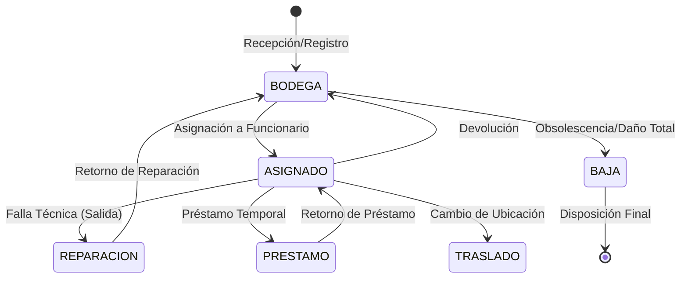
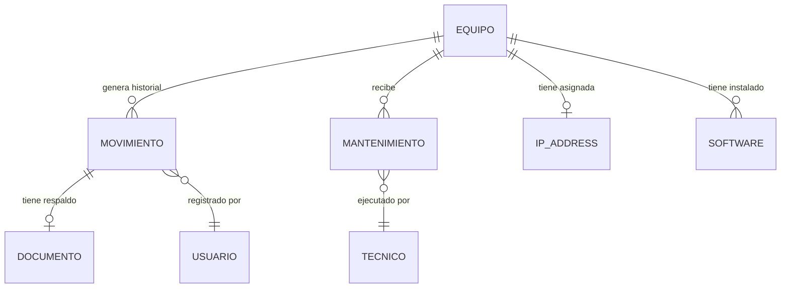

# Planificación de Arquitectura: Módulo de Gestión de Activos TIC

Este documento presenta el diseño arquitectónico y funcional para el módulo de Gestión de Activos TIC del ERP SAG. Se
enfoca en las mejores prácticas de **IT Asset Management (ITAM)** y **CMDB (Configuration Management Database)** para
asegurar la trazabilidad completa, integridad de datos y escalabilidad del sistema.

---

## 1. Análisis del Dominio

La Gestión de Activos TIC no es un simple inventario de bodega; es la administración del valor, la configuración y el
ciclo de vida de los recursos tecnológicos de la institución.

### Conceptos Clave

* **Activo TIC (Asset):** Cualquier componente tecnológico que tiene un valor para la organización, una identidad
  única (Serie/Inventario) y requiere seguimiento individual. A diferencia de los suministros (toner, cables), los
  activos tienen una "hoja de vida".
* **CMDB (Configuration Management Database):** El sistema debe actuar como una CMDB ligera, registrando no solo qué
  tenemos, sino cómo está configurado (IP, Software, Relaciones).
* **Identidad vs. Estado:** Un concepto fundamental es separar la identidad física del equipo de sus estados lógicos. La
  identidad es permanente; el estado es transitorio.

### El Problema de la Mutabilidad

El modelo actual mezcla datos inmutables con variables. Al cambiar el responsable en la ficha del equipo, se destruye el
dato anterior. La arquitectura propuesta trata al `Equipo` como una entidad estática y a sus atributos variables como
una serie de eventos proyectados.

---

## 2. Ciclo de Vida del Activo

El activo atraviesa múltiples estados. Cada transición es un evento auditable que genera un cambio en la configuración.

### Flujo Detallado:

1. **Compra y Recepción:** El activo ingresa al sistema con datos de adquisición (Factura, Orden de Compra).
2. **Registro e Identificación:** Se le asigna un número de inventario interno y se registran sus specs técnicas fijas.
3. **Asignación de Recursos:** Se le vincula un responsable humano, una ubicación física y una dirección IP.
4. **Mantenimiento:** Durante su uso, puede requerir mantenimientos preventivos o correctivos.
5. **Baja Definitiva:** Cuando el activo ya no es apto para el servicio, se retira formalmente del inventario activo.

---

## 3. Modelado del Dominio (Entidades Conceptual)

### A. Entidad: Activo (El Contenedor)

* **Responsabilidad:** Almacenar la identidad permanente.
* **Campos Fijos:** Serie, MAC Address, Marca, Modelo, Fecha de Compra, Especificaciones de Hardware Base.
* **Campos de Proyección (Caché):** Estado actual, Responsable actual, IP actual, Ubicación actual.

### B. Entidad: Movimiento (El Kardex)

* **Responsabilidad:** Registrar cada cambio de estado.
* **Campos:** Tipo (Asignación, Reparación, IP, etc.), Fecha, Actor Origen, Actor Destino, Observaciones, Documento
  adjunto.

### C. Entidades Complementarias

* **IP_Address:** Catálogo de direcciones IP gestionadas.
* **Mantenimiento:** Detalle técnico de reparaciones (Costos, repuestos, técnicos externos).
* **Documento:** Actas de entrega, informes de baja, facturas.
* **Software_Licencia:** Relación de software legal instalado en el hardware.

---

## 4. Relaciones entre Entidades

---

## 5. Arquitectura Recomendada: Kardex con Proyección

Se recomienda un enfoque híbrido: **Event Ledger + State Projection**.

### ¿Por qué este enfoque?

1. **Modelo Único de Movimientos (Kardex):** Actúa como la "Fuente de Verdad". Cada fila es un evento inmutable. Es
   ideal para auditorías.
2. **Estado Proyectado:** El modelo `Equipo` guarda una "fotografía" del último estado para que los listados y búsquedas
   sean instantáneos (evitando procesar miles de movimientos en cada carga).

### Ventajas vs. Alternativas:

* **Vs. Modelos Especializados:** Evitamos tener la historia dispersa en 10 tablas (Asignacion, Baja, Reparacion, etc.),
  lo cual facilita reportes cronológicos.
* **Vs. Solo Equipo:** Evitamos la pérdida de datos históricos.

---

## 6. Estado Actual vs. Historial

* **Integridad:** No se permite editar los campos `responsable` o `estado` directamente en el `Equipo`.
* **Gatillo (Trigger):** La única forma de actualizar el estado del equipo es creando un nuevo `Movimiento`. El sistema
  actualizará el "Caché" del equipo automáticamente.
* **Consistencia:** Si se borra un movimiento (acción restringida), el sistema debe recalcular la proyección basándose
  en el movimiento inmediatamente anterior.

---

## 7. Reglas de Negocio

1. **Unicidad de IP:** Una dirección IP solo puede estar en estado "Asignada" a un equipo activo a la vez.
2. **Bloqueo por Reparación:** Un equipo en estado "En Reparación" no puede ser asignado a un funcionario.
3. **Ciclo de Préstamo:** No se puede realizar un nuevo préstamo de un equipo que ya está marcado como "Prestado" hasta
   que se registre su devolución.
4. **Validación de Baja:** Un equipo dado de baja queda inhabilitado para cualquier movimiento futuro, excepto consulta
   histórica.
5. **Evidencia Legal:** Todo movimiento de "Asignación" o "Devolución" debe generar/adjuntar un Acta en PDF firmada.
6. **Responsabilidad Única:** Un activo solo puede tener un responsable activo en un momento dado.

---

## 8. Casos de Uso Detallados

### UC-01: Asignar Activo a Funcionario

* **Actor:** Encargado de TIC.
* **Flujo:** Selecciona equipo disponible -> Selecciona funcionario -> Asigna IP -> El sistema genera movimiento tipo "
  ASIGNACIÓN" -> Se actualiza el equipo -> Se genera Acta PDF.
* **Validaciones:** El equipo debe estar en Bodega. El funcionario debe estar activo.

### UC-02: Cambio de IP

* **Actor:** Administrador de Red.
* **Flujo:** Selecciona equipo -> Libera IP actual -> Selecciona nueva IP -> Registra motivo -> Sistema crea movimiento
  tipo "CAMBIO_IP".
* **Resultado:** La IP anterior vuelve al pool de disponibles. La nueva queda asociada al equipo.

### UC-03: Salida a Reparación

* **Actor:** Soporte Técnico.
* **Flujo:** Registra falla -> Selecciona técnico/empresa -> Genera movimiento "SALIDA_REPARACION" -> Equipo cambia
  estado a "REPARACION".
* **Validación:** Se debe registrar el número de ticket de soporte asociado.

---

## 9. Auditoría y Trazabilidad

Para cumplir con estándares gubernamentales, cada movimiento debe registrar:

* **Usuario (ID):** Quién ejecutó la acción.
* **Timestamp:** Fecha y hora exacta.
* **Metadata:** IP del cliente, Navegador (User Agent).
* **Checksum:** Opcionalmente, un hash que garantice que el registro del movimiento no ha sido alterado en la DB.

---

## 10. Escalabilidad

* **JSON Fields:** Las especificaciones técnicas específicas de cada tipo de equipo (ej. tipo de lente en un escáner vs.
  número de puertos en un switch) se almacenarán en un campo JSON para evitar crear cientos de columnas.
* **API First:** La arquitectura de movimientos permite que en el futuro el sistema se integre con agentes de inventario
  automático (como OCS Inventory o GLPI) mediante una API que registre los movimientos de cambio de hardware
  automáticamente.

---

## 11. Recomendaciones Finales

Como Arquitecto, implementaría la solución siguiendo el patrón **Service Layer**:

1. Los modelos (`Equipo`, `Movimiento`) solo definen datos.
2. Toda la lógica de negocio (validar stock, asignar IP, generar PDF) reside en una **Capa de Servicios**.
3. Esto asegura que, ya sea que el cambio venga de un formulario web, una tarea programada o una API, las reglas de
   negocio se apliquen siempre de la misma forma.

**Esta arquitectura garantiza que el ERP SAG sea una herramienta de auditoría real y no solo un registro estático de
equipos.**

---
**Diseñado para:** ERP SAG - Gestión de Activos TIC.
**,filename: