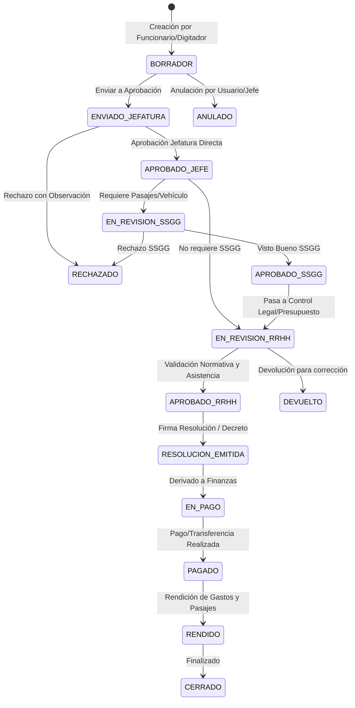
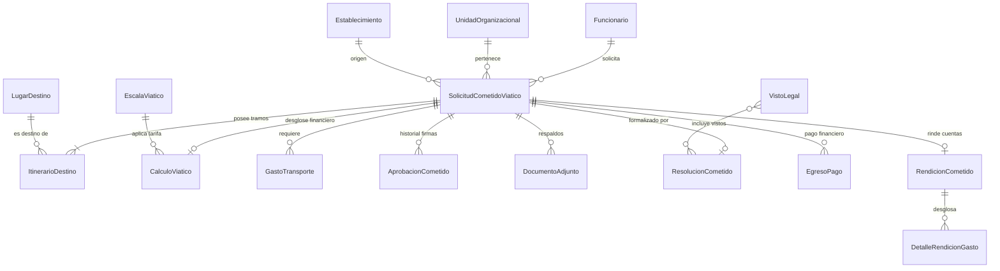
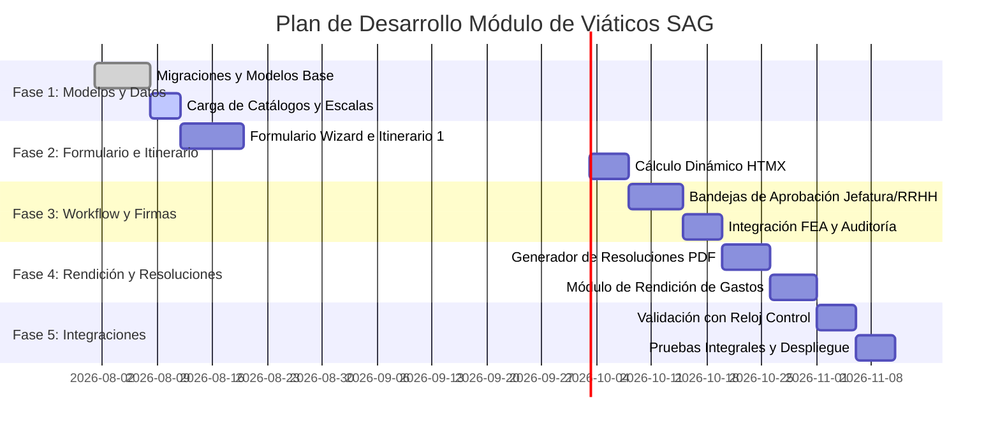

# Arquitectura y Diseño de Modelos: Sistema de Cometidos y Viáticos (SAG)

Este documento detalla el análisis del sistema heredado (SIA / Oracle SIABI), el diagnóstico técnico de oportunidades de
mejora y la especificación completa de la arquitectura de datos, modelos Django, workflows de aprobación y estrategia de
comunicación para el nuevo módulo de **Cometidos Funcionales y Viáticos** del ERP SAG.

---

## 1. Diagnóstico del Sistema Heredado (SIA) y Oportunidades de Optimización

El análisis de las tablas heredadas (`SIAINGRESOVIATICO`, `SIAINGRESOCOMETIDO`, `SIAINGRESOVIARECHAZA`, `SIAPASAJES`,
etc.) revela importantes ineficiencias arquitectónicas y de modelado:

| Ineficiencia en Sistema Heredado                                      | Problema Técnico / Operativo                                                                                                  | Solución en la Nueva Arquitectura                                                                                                          |
|:----------------------------------------------------------------------|:------------------------------------------------------------------------------------------------------------------------------|:-------------------------------------------------------------------------------------------------------------------------------------------|
| **Tablas Espejo para Rechazados** (`*RECHAZA`)                        | Duplicidad de esquemas, riesgo de desincronización, lógica duplicada para consultas históricas y reportes.                    | **Máquina de Estados Unificada + Historial de Transiciones**. Una sola tabla con campo `estado` y tabla de auditoría/rechazos.             |
| **Separación Artificial entre Cometidos y Viáticos**                  | `SIAINGRESOCOMETIDO` y `SIAINGRESOVIATICO` comparten el 85% de sus atributos (funcionario, fechas, transporte, aprobaciones). | **Modelo Núcleo Unificado** (`SolicitudCometidoViatico`) con sub-módulo financiero/cálculo opcional cuando genera derecho a viático.       |
| **Lugar Único por Solicitud** (`LUGAR` INTEGER o `DESLUGAR` VARCHAR)  | Imposibilidad de registrar rutas complejas, paradas intermedias, pernoctas escalonadas o kilometrajes por tramo.              | **Modelo Itinerario 1:N** (`ItinerarioDestino`): permite múltiples destinos por cometido, orden cronológico y justificación por parada.    |
| **Tablas Separadas de Pasajes** (`SIAPASAJES` vs `SIAPASAJESAE`)      | Duplicidad entre transporte terrestre/combustible y aéreo.                                                                    | **Modelo Unificado de Transporte y Pasajes** (`GastoTransporte`) con discriminador de tipo (Aéreo, Terrestre, Vales Combustible, Peajes).  |
| **Columnas Rígidas de Firmas** (`APRUEBA_JEFE`, `APRUEBA_SSGG`, etc.) | Imposibilidad de configurar flujos dinámicos, subrogancias auditables, firmas escalonadas o delegaciones de firma.            | **Motor de Workflow y Firmas** (`AprobacionCometido`): registro desacoplado por etapa, usuario real, rol subrogante y firma digital (FEA). |
| **Desacoplamiento de Entidades Maestras**                             | Redundancia de datos de funcionarios, cargos, departamentos y cuentas bancarias almacenados como texto libre.                 | **Integración Total con Core SAG** (`core.Funcionario`, `core.UnidadOrganizacional`, `core.Establecimiento`, `core.User`).                 |

---

## 2. Estrategia y Principios de Diseño

### 2.1. Itinerario Multidestino (1:N)

Un cometido puede abarcar una o más localidades (ej. La Serena -> Vicuña -> Paihuano -> La Serena). El modelo
`ItinerarioDestino` desglosa:

* Localidad o punto específico de destino.
* Fecha/hora estimada de llegada y salida.
* Si el tramo contempla pernocta, alimentación parcial o faena.
* Medio de transporte asignado al tramo.

### 2.2. Máquina de Estados y Auditoría

La solicitud transita por un ciclo de vida formalmente definido:



### 2.3. Desglose Financiero y Cálculo Paramétrico

Las tarifas de viático (100% pernocta, 50% alimentación/parcial, faena) se calculan automáticamente en función de la
escala vigente (`EscalaViatico`), el grado/estamento del funcionario y los días/noches resultantes del itinerario,
evitando cálculos manuales propensos a error.

---

## 3. Diagrama Entidad-Relación (ER)



---

## 4. Modelos de Datos en Django (Especificación Técnica)

A continuación se detalla la implementación modular de los modelos para la nueva aplicación `viaticos`. Todos los
modelos heredan de `core.standard.models.StandardModel` o `StandardModelEstablishment` garantizando auditoría nativa (
`created_by`, `updated_by`, `created_at`, `updated_at`, `history` con `simple_history`).

### 4.1. Módulo de Parámetros y Catálogos (`viaticos/models/catalogos.py`)

```python
from django.db import models
from core.standard.models import StandardModel, StandardModelEstablishment

class LugarDestino(StandardModelEstablishment):
    """
    Catálogo centralizado de destinos, comunas, localidades o zonas de comisión.
    Reemplaza la tabla SIALUGAR y campos de texto libre.
    """
    codigo = models.CharField(max_length=20, unique=True, verbose_name="Código de Lugar")
    nombre = models.CharField(max_length=255, verbose_name="Nombre / Ciudad / Localidad")
    region = models.CharField(max_length=100, default="Coquimbo", verbose_name="Región")
    comuna = models.CharField(max_length=100, blank=True, null=True, verbose_name="Comuna")
    descripcion_adicional = models.TextField(blank=True, null=True, verbose_name="Detalle de Ubicación")
    es_rural_dificil_acceso = models.BooleanField(default=False, verbose_name="¿Zona rural / difícil acceso?")
    distancia_km_referencial = models.PositiveIntegerField(default=0, verbose_name="Distancia ref. (KM)")

    UPPERCASE_FIELDS = ['codigo', 'nombre', 'region', 'comuna']

    class Meta:
        verbose_name = "Lugar de Destino"
        verbose_name_plural = "Lugares de Destino"
        ordering = ["nombre"]

    def __str__(self):
        return f"{self.nombre} ({self.comuna or self.region})"


class EscalaViatico(StandardModel):
    """
    Matriz de valores y tarifas legales de viáticos según estamento, grado y año.
    Permite parametrizar montos de 100% (pernocta), 50% (parcial) y faena.
    """
    ano_vigencia = models.PositiveIntegerField(verbose_name="Año de Vigencia")
    grado_desde = models.CharField(max_length=2, verbose_name="Grado Desde")
    grado_hasta = models.CharField(max_length=2, verbose_name="Grado Hasta")
    estamento = models.CharField(max_length=100, blank=True, null=True, verbose_name="Estamento / Ley")
    
    valor_100_pernocta = models.DecimalField(max_digits=12, decimal_places=2, verbose_name="Valor 100% Pernocta ($)")
    valor_50_parcial = models.DecimalField(max_digits=12, decimal_places=2, verbose_name="Valor 50% Alimentación ($)")
    valor_faena = models.DecimalField(max_digits=12, decimal_places=2, default=0, verbose_name="Valor Faena ($)")
    observacion = models.CharField(max_length=255, blank=True, null=True, verbose_name="Observaciones")

    class Meta:
        verbose_name = "Escala de Viático"
        verbose_name_plural = "Escalas de Viáticos"
        ordering = ["-ano_vigencia", "grado_desde"]

    def __str__(self):
        return f"Año {self.ano_vigencia} - Grados {self.grado_desde} a {self.grado_hasta} ($ {self.valor_100_pernocta})"


class VistoLegal(StandardModelEstablishment):
    """
    Catálogo de considerandos y 'Vistos' jurídicos para resoluciones y decretos exentos.
    Reemplaza la tabla SIAVISTOS.
    """
    codigo = models.CharField(max_length=50, verbose_name="Código / Referencia")
    texto_visto = models.TextField(verbose_name="Texto del Visto Legal")
    corresponde_a = models.CharField(max_length=100, blank=True, null=True, verbose_name="Tipo (Cometido/Viático/Ambos)")
    orden = models.PositiveIntegerField(default=1, verbose_name="Orden de Aparición")

    class Meta:
        verbose_name = "Visto Legal"
        verbose_name_plural = "Vistos Legales"
        ordering = ["orden", "codigo"]

    def __str__(self):
        return f"{self.codigo} - {self.texto_visto[:80]}..."
```

---

### 4.2. Módulo Núcleo: Solicitud, Itinerario y Cálculo (`viaticos/models/solicitud.py`)

```python
from django.db import models
from django.conf import settings
from core.standard.models import StandardModelEstablishment

class SolicitudCometidoViatico(StandardModelEstablishment):
    """
    Modelo unificado para Cometidos Funcionales y Solicitudes de Viáticos.
    Reemplaza SIAINGRESOCOMETIDO, SIAINGRESOVIATICO, SIAINGRESOCOMETIDORECHAZA y SIAINGRESOVIARECHAZA.
    """
    TIPO_SOLICITUD_CHOICES = [
        ('COMETIDO_SIMPLE', 'Cometido Funcional (Sin Viático)'),
        ('COMETIDO_VIATICO', 'Cometido Funcional con Viático'),
        ('COMETIDO_PASAJES', 'Cometido Solo con Pasajes / Vales'),
    ]

    ESTADO_CHOICES = [
        ('BORRADOR', 'Borrador'),
        ('ENVIADO_JEFATURA', 'Enviado a Jefatura'),
        ('APROBADO_JEFE', 'Aprobado por Jefatura Directa'),
        ('EN_REVISION_SSGG', 'En Revisión Servicios Generales (Transporte)'),
        ('APROBADO_SSGG', 'Aprobado por Servicios Generales'),
        ('EN_REVISION_RRHH', 'En Revisión RRHH / Personal'),
        ('APROBADO_RRHH', 'Aprobado por RRHH'),
        ('RESOLUCION_EMITIDA', 'Resolución Emitida'),
        ('EN_PAGO', 'En Trámite de Pago / Finanzas'),
        ('PAGADO', 'Pagado'),
        ('RENDIDO', 'Rendido'),
        ('DEVUELTO', 'Devuelto para Corrección'),
        ('RECHAZADO', 'Rechazado'),
        ('ANULADO', 'Anulado'),
    ]

    folio = models.PositiveIntegerField(verbose_name="N° Folio Correlativo")
    ano = models.PositiveIntegerField(verbose_name="Año Presupuestario")
    tipo_solicitud = models.CharField(max_length=30, choices=TIPO_SOLICITUD_CHOICES, default='COMETIDO_VIATICO', verbose_name="Tipo de Solicitud")
    estado = models.CharField(max_length=30, choices=ESTADO_CHOICES, default='BORRADOR', verbose_name="Estado Actual")

    # Funcionario y Dependencia (Integración con Core)
    funcionario = models.ForeignKey('core.Funcionario', on_delete=models.PROTECT, related_name="solicitudes_viatico", verbose_name="Funcionario Solicitante")
    unidad_organizacional = models.ForeignKey('core.UnidadOrganizacional', on_delete=models.PROTECT, related_name="solicitudes_viatico", verbose_name="Unidad / Depto.")
    cargo_desempenado = models.CharField(max_length=255, blank=True, null=True, verbose_name="Cargo al Momento de la Comisión")
    grado_funcionario = models.CharField(max_length=5, blank=True, null=True, verbose_name="Grado")

    # Justificación y Temporalidad General
    motivo_viaje = models.TextField(verbose_name="Motivo / Justificación del Cometido")
    fecha_inicio = models.DateField(verbose_name="Fecha de Inicio")
    fecha_termino = models.DateField(verbose_name="Fecha de Término")
    hora_salida = models.TimeField(verbose_name="Hora Salida")
    hora_llegada = models.TimeField(verbose_name="Hora Estimada Llegada")
    total_dias = models.PositiveIntegerField(default=1, verbose_name="Total Días Comisión")

    # Flags Operativos
    es_proyecto = models.BooleanField(default=False, verbose_name="¿Financiado con Fondos de Proyecto?")
    nombre_codigo_proyecto = models.CharField(max_length=255, blank=True, null=True, verbose_name="Nombre / Código Proyecto")
    es_urgente = models.BooleanField(default=False, verbose_name="¿Carácter Urgente / Prioritario?")
    tiene_derecho_pasaje = models.BooleanField(default=False, verbose_name="¿Tiene Derecho a Pasajes?")
    requiere_vehiculo_institucional = models.BooleanField(default=False, verbose_name="¿Requiere Vehículo Institucional?")
    requiere_vales_bencina = models.BooleanField(default=False, verbose_name="¿Requiere Vales de Combustible?")

    # Control de Fechas Clave
    fecha_solicitud = models.DateTimeField(auto_now_add=True, verbose_name="Fecha Solicitud")
    fecha_aprobacion_jefe = models.DateTimeField(blank=True, null=True, verbose_name="Fecha Aprobación Jefe")
    fecha_aprobacion_rrhh = models.DateTimeField(blank=True, null=True, verbose_name="Fecha Aprobación RRHH")
    fecha_pago = models.DateField(blank=True, null=True, verbose_name="Fecha de Pago Efectiva")

    # Motivos de Devolución / Anulación
    motivo_rechazo_devolucion = models.TextField(blank=True, null=True, verbose_name="Motivo de Devolución / Rechazo")

    UPPERCASE_FIELDS = ['cargo_desempenado', 'nombre_codigo_proyecto']

    class Meta:
        verbose_name = "Solicitud de Cometido y Viático"
        verbose_name_plural = "Solicitudes de Cometidos y Viáticos"
        unique_together = ('folio', 'ano', 'establecimiento')
        ordering = ['-ano', '-folio']

    def __str__(self):
        return f"Folio {self.folio}/{self.ano} - {self.funcionario} ({self.get_estado_display()})"


class ItinerarioDestino(StandardModel):
    """
    MODELO CLAVE PARA EFICIENCIA (1:N):
    Registra cada uno de los lugares y tramos que componen el recorrido del cometido.
    Permite auditar el trayecto completo, tiempos por localidad y justificación de pernocta.
    """
    solicitud = models.ForeignKey(SolicitudCometidoViatico, on_delete=models.CASCADE, related_name="itinerarios", verbose_name="Solicitud de Viático")
    orden_visita = models.PositiveSmallIntegerField(default=1, verbose_name="Orden de Parada / Secuencia")
    
    lugar_destino = models.ForeignKey('viaticos.LugarDestino', on_delete=models.PROTECT, related_name="tramos_itinerario", verbose_name="Destino")
    descripcion_actividad_lugar = models.CharField(max_length=500, verbose_name="Actividad Específica en este Destino")
    
    fecha_llegada = models.DateField(verbose_name="Fecha Llegada")
    fecha_salida = models.DateField(verbose_name="Fecha Salida")
    
    # Categorización de Viático por Tramo
    pernocta_en_lugar = models.BooleanField(default=False, verbose_name="¿Pernocta en este lugar?")
    aplica_alimentacion_50 = models.BooleanField(default=False, verbose_name="¿Aplica 50% Alimentación?")
    aplica_faena = models.BooleanField(default=False, verbose_name="¿Aplica Tarifa Faena?")

    medio_transporte_tramo = models.CharField(
        max_length=50,
        choices=[
            ('VEHICULO_INSTITUCIONAL', 'Vehículo Institucional'),
            ('BUS_INTERURBANO', 'Bus Interurbano'),
            ('AVION', 'Avión'),
            ('VEHICULO_PARTICULAR', 'Vehículo Particular'),
            ('OTRO', 'Otro Transporte'),
        ],
        default='VEHICULO_INSTITUCIONAL',
        verbose_name="Medio de Transporte en Tramo"
    )

    class Meta:
        verbose_name = "Tramo de Itinerario"
        verbose_name_plural = "Tramos de Itinerario"
        ordering = ["solicitud", "orden_visita"]

    def __str__(self):
        return f"Parada #{self.orden_visita}: {self.lugar_destino} ({self.fecha_llegada} a {self.fecha_salida})"


class CalculoViatico(StandardModel):
    """
    Entidad 1:1 con la Solicitud para almacenar la liquidación y cálculo de montos.
    Garantiza inmutabilidad histórica una vez aprobada la resolución.
    """
    solicitud = models.OneToOneField(SolicitudCometidoViatico, on_delete=models.CASCADE, related_name="calculo_financiero", verbose_name="Solicitud")
    escala_aplicada = models.ForeignKey('viaticos.EscalaViatico', on_delete=models.PROTECT, verbose_name="Escala Tarifaria Aplicada")

    # Días y Valores 100% (Pernocta)
    dias_100 = models.PositiveIntegerField(default=0, verbose_name="Días 100% (Pernocta)")
    monto_unitario_100 = models.DecimalField(max_digits=12, decimal_places=2, default=0, verbose_name="Monto Unitario 100%")
    total_monto_100 = models.DecimalField(max_digits=12, decimal_places=2, default=0, verbose_name="Subtotal 100%")

    # Días y Valores 50% (Alimentación / Parcial)
    dias_50 = models.PositiveIntegerField(default=0, verbose_name="Días 50% (Parcial)")
    monto_unitario_50 = models.DecimalField(max_digits=12, decimal_places=2, default=0, verbose_name="Monto Unitario 50%")
    total_monto_50 = models.DecimalField(max_digits=12, decimal_places=2, default=0, verbose_name="Subtotal 50%")

    # Días y Valores Faena
    dias_faena = models.PositiveIntegerField(default=0, verbose_name="Días Faena")
    monto_unitario_faena = models.DecimalField(max_digits=12, decimal_places=2, default=0, verbose_name="Monto Unitario Faena")
    total_monto_faena = models.DecimalField(max_digits=12, decimal_places=2, default=0, verbose_name="Subtotal Faena")

    # Total Liquidado
    total_bruto_viatico = models.DecimalField(max_digits=12, decimal_places=2, default=0, verbose_name="Total Viático Liquidado ($)")
    monto_anticipo_entregado = models.DecimalField(max_digits=12, decimal_places=2, default=0, verbose_name="Monto Anticipo ($)")
    saldo_a_pagar = models.DecimalField(max_digits=12, decimal_places=2, default=0, verbose_name="Saldo Final a Pagar ($)")

    class Meta:
        verbose_name = "Cálculo y Liquidación de Viático"
        verbose_name_plural = "Cálculos y Liquidaciones de Viáticos"

    def __str__(self):
        return f"Liquidación Solicitud #{self.solicitud.folio}: $ {self.total_bruto_viatico}"
```

---

### 4.3. Módulo de Movilidad, Pasajes y Combustibles (`viaticos/models/transporte.py`)

```python
from django.db import models
from core.standard.models import StandardModel

class GastoTransporte(StandardModel):
    """
    Unifica SIAPASAJES y SIAPASAJESAE en un único modelo escalable para traslados,
    pasajes aéreos/terrestres, reembolsos de peajes, estacionamiento y combustible.
    """
    TIPO_GASTO_CHOICES = [
        ('AEREO', 'Pasaje Aéreo Comercial'),
        ('BUS_FERROCARRIL', 'Pasaje Bus / Ferrocarril'),
        ('VALE_COMBUSTIBLE', 'Vale de Combustible Institucional'),
        ('REEMBOLSO_BENCINA', 'Reembolso Combustible Vehículo Particular'),
        ('PEAJE_ESTACIONAMIENTO', 'Peajes y Estacionamientos'),
        ('OTRO_TRANSPORTE', 'Otro Tipo de Transporte'),
    ]

    solicitud = models.ForeignKey('viaticos.SolicitudCometidoViatico', on_delete=models.CASCADE, related_name="gastos_transporte", verbose_name="Solicitud")
    tipo_gasto = models.CharField(max_length=30, choices=TIPO_GASTO_CHOICES, verbose_name="Tipo de Gasto / Pasaje")
    
    # Detalle General de Trayecto
    origen = models.CharField(max_length=150, verbose_name="Origen")
    destino = models.CharField(max_length=150, verbose_name="Destino")
    fecha_ida = models.DateField(verbose_name="Fecha Ida")
    fecha_regreso = models.DateField(blank=True, null=True, verbose_name="Fecha Regreso")

    # Datos Específicos para Transporte Aéreo
    aerolinea = models.CharField(max_length=100, blank=True, null=True, verbose_name="Línea Aérea")
    codigo_reserva_pnr = models.CharField(max_length=50, blank=True, null=True, verbose_name="Código de Reserva / PNR")
    numero_billete = models.CharField(max_length=100, blank=True, null=True, verbose_name="N° Billete / Ticket")

    # Datos Específicos para Combustible y Vehículo
    numero_vale_bencina = models.CharField(max_length=100, blank=True, null=True, verbose_name="N° de Vale(s) Combustible")
    tipo_combustible = models.CharField(max_length=50, blank=True, null=True, verbose_name="Tipo Combustible (93/95/97/Diesel)")
    kilometros_recorridos = models.PositiveIntegerField(default=0, verbose_name="Kilómetros Estimados / Recorridos")
    precio_por_litro = models.DecimalField(max_digits=10, decimal_places=2, default=0, verbose_name="Precio por Litro ($)")

    # Montos y Rendición
    monto_cotizado = models.DecimalField(max_digits=12, decimal_places=2, default=0, verbose_name="Monto Cotizado / Autorizado ($)")
    monto_real_ejecutado = models.DecimalField(max_digits=12, decimal_places=2, default=0, verbose_name="Monto Real Ejecutado ($)")
    pagado_directo_proveedor = models.BooleanField(default=False, verbose_name="¿Pagado por Orden de Compra Institucional?")

    class Meta:
        verbose_name = "Gasto de Transporte y Pasaje"
        verbose_name_plural = "Gastos de Transporte y Pasajes"
        ordering = ["fecha_ida"]

    def __str__(self):
        return f"{self.get_tipo_gasto_display()} - {self.origen} a {self.destino} ($ {self.monto_real_ejecutado or self.monto_cotizado})"
```

---

### 4.4. Módulo de Workflow, Firmas y Auditoría (`viaticos/models/workflow.py`)

```python
from django.db import models
from django.conf import settings
from core.standard.models import StandardModel

class AprobacionCometido(StandardModel):
    """
    Bitácora formal e inmutable de revisiones, autorizaciones, subrogancias y firmas.
    Soporta firma digital simple y Firma Electrónica Avanzada (FEA).
    """
    ETAPA_CHOICES = [
        ('JEFE_DIRECTO', 'Aprobación Jefatura Directa'),
        ('SERVICIOS_GENERALES', 'Revisión y Asignación de SSGG'),
        ('RRHH_CONTROL', 'Control Normativo y Reloj Control (RRHH)'),
        ('DIRECCION_FIRMA', 'Firma Resolución (Director / Delegado)'),
        ('FINANZAS_PAGO', 'Autorización de Pago (Finanzas)'),
    ]

    ESTADO_ACCION_CHOICES = [
        ('APROBADO', 'Aprobado / Firmado'),
        ('RECHAZADO', 'Rechazado'),
        ('DEVUELTO', 'Devuelto con Observaciones'),
        ('SUBROGADO', 'Aprobado en Subrogancia'),
    ]

    solicitud = models.ForeignKey('viaticos.SolicitudCometidoViatico', on_delete=models.CASCADE, related_name="historial_aprobaciones", verbose_name="Solicitud")
    etapa = models.CharField(max_length=30, choices=ETAPA_CHOICES, verbose_name="Etapa del Flujo")
    accion = models.CharField(max_length=20, choices=ESTADO_ACCION_CHOICES, verbose_name="Acción Realizada")
    
    usuario_firmante = models.ForeignKey(settings.AUTH_USER_MODEL, on_delete=models.PROTECT, related_name="firmas_cometidos", verbose_name="Usuario Firmante")
    en_calidad_de = models.CharField(max_length=150, verbose_name="Cargo / Calidad (Titular / Subrogante)")
    es_subrogante = models.BooleanField(default=False, verbose_name="¿Firma como Subrogante?")
    
    observaciones = models.TextField(blank=True, null=True, verbose_name="Observaciones / Motivo de Rechazo")
    fecha_hora_accion = models.DateTimeField(auto_now_add=True, verbose_name="Fecha y Hora de la Acción")
    
    # Firma Electrónica
    firmado_con_fea = models.BooleanField(default=False, verbose_name="¿Firmado con FEA?")
    hash_firma_digital = models.CharField(max_length=255, blank=True, null=True, verbose_name="Hash / Certificado Firma")
    ip_registro = models.GenericIPAddressField(blank=True, null=True, verbose_name="IP de Firma")

    class Meta:
        verbose_name = "Aprobación / Firma de Cometido"
        verbose_name_plural = "Aprobaciones y Firmas de Cometidos"
        ordering = ["fecha_hora_accion"]

    def __str__(self):
        return f"[{self.get_etapa_display()}] {self.usuario_firmante} -> {self.get_accion_display()} ({self.fecha_hora_accion.strftime('%d/%m/%Y %H:%M')})"
```

---

### 4.5. Módulo Legal: Resoluciones y Vistos (`viaticos/models/resoluciones.py`)

```python
from django.db import models
from core.standard.models import StandardModelEstablishment

class ResolucionCometido(StandardModelEstablishment):
    """
    Formalización administrativa del cometido mediante Decreto / Resolución Exenta.
    Reemplaza la lógica dispersa de SIAVISTOS y SIAFIRMANTESDESP.
    """
    solicitud = models.OneToOneField('viaticos.SolicitudCometidoViatico', on_delete=models.PROTECT, related_name="resolucion_formal", verbose_name="Solicitud")
    numero_resolucion = models.PositiveIntegerField(verbose_name="N° Resolución Exenta")
    ano_resolucion = models.PositiveIntegerField(verbose_name="Año Resolución")
    fecha_emision = models.DateField(verbose_name="Fecha de Emisión")
    
    vistos = models.ManyToManyField('viaticos.VistoLegal', related_name="resoluciones", verbose_name="Vistos Legales Aplicados")
    considerandos = models.TextField(verbose_name="Considerandos Específicos")
    texto_resuelve = models.TextField(verbose_name="Cuerpo del Resuelve")

    firmante_nombre = models.CharField(max_length=200, verbose_name="Nombre Firmante Legal")
    firmante_cargo = models.CharField(max_length=200, verbose_name="Cargo Firmante Legal")
    
    documento_pdf_firmado = models.FileField(upload_to="viaticos/resoluciones/%Y/", blank=True, null=True, verbose_name="PDF Resolución Firmada")

    class Meta:
        verbose_name = "Resolución Exenta de Cometido"
        verbose_name_plural = "Resoluciones Exentas de Cometidos"
        unique_together = ('numero_resolucion', 'ano_resolucion', 'establecimiento')
        ordering = ['-ano_resolucion', '-numero_resolucion']

    def __str__(self):
        return f"Res. Exenta N° {self.numero_resolucion}/{self.ano_resolucion} - Solicitud #{self.solicitud.folio}"
```

---

### 4.6. Módulo Financiero, Pagos y Rendiciones (`viaticos/models/finanzas.py`)

```python
from django.db import models
from core.standard.models import StandardModelEstablishment

class EgresoPagoViatico(StandardModelEstablishment):
    """
    Control de egreso de fondos, emisión de cheques, transferencias bancarias y despachos.
    Reemplaza SIAEGRESOS y SIADESPACHO.
    """
    MEDIO_PAGO_CHOICES = [
        ('TRANSFERENCIA', 'Transferencia Electrónica'),
        ('CHEQUE', 'Cheque Nominativo'),
        ('EFECTIVO_CAJA_CHICA', 'Efectivo / Caja Chica'),
    ]

    solicitud = models.ForeignKey('viaticos.SolicitudCometidoViatico', on_delete=models.PROTECT, related_name="egresos_pago", verbose_name="Solicitud")
    numero_egreso = models.PositiveIntegerField(verbose_name="N° Egreso Presupuestario")
    ano_egreso = models.PositiveIntegerField(verbose_name="Año Egreso")
    
    medio_pago = models.CharField(max_length=30, choices=MEDIO_PAGO_CHOICES, default='TRANSFERENCIA', verbose_name="Medio de Pago")
    monto_total_pagado = models.DecimalField(max_digits=12, decimal_places=2, verbose_name="Monto Total Pagado ($)")
    
    # Datos de Cheque o Transferencia
    id_transferencia_bancaria = models.CharField(max_length=100, blank=True, null=True, verbose_name="ID / N° Transferencia")
    numero_cheque = models.CharField(max_length=50, blank=True, null=True, verbose_name="N° de Cheque")
    banco_origen = models.CharField(max_length=100, blank=True, null=True, verbose_name="Banco Origen")
    cuenta_origen = models.CharField(max_length=50, blank=True, null=True, verbose_name="N° Cuenta Corriente Origen")
    
    # Beneficiario
    rut_beneficiario = models.CharField(max_length=12, verbose_name="RUT Beneficiario")
    nombre_beneficiario = models.CharField(max_length=200, verbose_name="Nombre Beneficiario")
    cuenta_destino = models.CharField(max_length=50, blank=True, null=True, verbose_name="Cuenta Bancaria Destino")

    fecha_pago = models.DateField(verbose_name="Fecha de Pago")
    glosa_contable = models.TextField(blank=True, null=True, verbose_name="Glosa Contable / Detalle")

    class Meta:
        verbose_name = "Egreso y Pago de Viático"
        verbose_name_plural = "Egresos y Pagos de Viáticos"
        unique_together = ('numero_egreso', 'ano_egreso', 'establecimiento')

    def __str__(self):
        return f"Egreso #{self.numero_egreso}/{self.ano_egreso} - $ {self.monto_total_pagado} ({self.nombre_beneficiario})"


class RendicionCometido(StandardModelEstablishment):
    """
    Rendición final de gastos y cuentas tras el regreso del funcionario.
    Controla diferencias a devolver por el funcionario o saldos a favor.
    """
    solicitud = models.OneToOneField('viaticos.SolicitudCometidoViatico', on_delete=models.PROTECT, related_name="rendicion_cuentas", verbose_name="Solicitud")
    fecha_rendicion = models.DateField(verbose_name="Fecha de Rendición")
    
    total_anticipo_recibido = models.DecimalField(max_digits=12, decimal_places=2, default=0, verbose_name="Total Anticipo Recibido ($)")
    total_gastos_rendidos = models.DecimalField(max_digits=12, decimal_places=2, default=0, verbose_name="Total Gastos Justificados ($)")
    monto_a_devolver_institucion = models.DecimalField(max_digits=12, decimal_places=2, default=0, verbose_name="Monto a Reintegrar por Funcionario ($)")
    monto_a_reembolsar_funcionario = models.DecimalField(max_digits=12, decimal_places=2, default=0, verbose_name="Monto a Reembolsar al Funcionario ($)")
    
    informe_cometido_cumplido = models.TextField(verbose_name="Informe Ejecutivo de Actividades Cumplidas")
    rendicion_aprobada = models.BooleanField(default=False, verbose_name="¿Rendición Aprobada por Jefatura y Finanzas?")

    class Meta:
        verbose_name = "Rendición de Cometido y Cuentas"
        verbose_name_plural = "Rendiciones de Cometidos y Cuentas"

    def __str__(self):
        return f"Rendición Solicitud #{self.solicitud.folio} - Aprobada: {self.rendicion_aprobada}"


class DetalleRendicionGasto(StandardModel):
    """
    Línea de detalle para boletas, facturas, peajes y respaldos adjuntos en la rendición.
    """
    rendicion = models.ForeignKey(RendicionCometido, on_delete=models.CASCADE, related_name="detalles_gasto", verbose_name="Rendición")
    tipo_documento = models.CharField(max_length=50, verbose_name="Tipo (Boleta / Factura / Ticket Peaje / Pasaje)")
    numero_documento = models.CharField(max_length=100, verbose_name="N° Documento")
    proveedor_razon_social = models.CharField(max_length=200, verbose_name="Razón Social / Proveedor")
    monto_documento = models.DecimalField(max_digits=12, decimal_places=2, verbose_name="Monto ($)")
    comprobante_digital = models.FileField(upload_to="viaticos/rendiciones/%Y/", blank=True, null=True, verbose_name="Imagen / PDF Comprobante")

    class Meta:
        verbose_name = "Detalle de Gasto Rendido"
        verbose_name_plural = "Detalles de Gastos Rendidos"
```

---

### 4.7. Módulo de Integración con Reloj Control y Control Gremial (`viaticos/models/control_asistencia.py`)

```python
from django.db import models
from core.standard.models import StandardModelEstablishment

class ValidacionRelojControl(StandardModelEstablishment):
    """
    Validación de concordancia entre los días del cometido y los registros del reloj control.
    Reemplaza SIACORTERELOJCONTROL.
    """
    funcionario = models.ForeignKey('core.Funcionario', on_delete=models.PROTECT, related_name="validaciones_asistencia", verbose_name="Funcionario")
    solicitud = models.ForeignKey('viaticos.SolicitudCometidoViatico', on_delete=models.SET_NULL, null=True, blank=True, related_name="validaciones_reloj", verbose_name="Cometido Asociado")
    
    fecha_inicio_ausencia = models.DateField(verbose_name="Fecha Inicio")
    fecha_termino_ausencia = models.DateField(verbose_name="Fecha Término")
    tipo_ausentismo = models.CharField(max_length=100, default="COMETIDO_FUNCIONAL", verbose_name="Tipo de Justificación de Asistencia")
    dias_justificados = models.PositiveIntegerField(verbose_name="Cantidad de Días")
    
    sincronizado_reloj = models.BooleanField(default=False, verbose_name="¿Sincronizado con Reloj Control?")
    observacion_corte = models.TextField(blank=True, null=True, verbose_name="Observaciones de Asistencia")

    class Meta:
        verbose_name = "Corte de Asistencia / Reloj Control"
        verbose_name_plural = "Cortes de Asistencia / Reloj Control"


class PermisoGremial(StandardModelEstablishment):
    """
    Registro y control de permisos gremiales y su compatibilidad con viáticos.
    Reemplaza SIAPERMISOGREMIAL.
    """
    folio_gremial = models.PositiveIntegerField(verbose_name="N° Folio Permiso Gremial")
    ano = models.PositiveIntegerField(verbose_name="Año")
    funcionario = models.ForeignKey('core.Funcionario', on_delete=models.PROTECT, related_name="permisos_gremiales", verbose_name="Dirigente / Funcionario")
    cargo_en_gremio = models.CharField(max_length=150, verbose_name="Cargo en la Asociación / Gremio")
    
    lugar_actividad = models.ForeignKey('viaticos.LugarDestino', on_delete=models.PROTECT, related_name="permisos_gremiales", verbose_name="Lugar Actividad")
    motivo = models.TextField(verbose_name="Motivo de la Actividad Gremial")
    fecha_desde = models.DateField(verbose_name="Desde")
    fecha_hasta = models.DateField(verbose_name="Hasta")
    
    aprobado = models.BooleanField(default=False, verbose_name="¿Aprobado por Autoridad?")
    aprobado_por = models.ForeignKey('core.Funcionario', on_delete=models.SET_NULL, null=True, blank=True, related_name="permisos_gremiales_aprobados", verbose_name="Aprobador")

    class Meta:
        verbose_name = "Permiso Gremial"
        verbose_name_plural = "Permisos Gremiales"
        unique_together = ('folio_gremial', 'ano', 'establecimiento')
```

---

## 5. Estrategia de Comunicación, APIs y Frontend (HTMX + Django)

### 5.1. Dinamismo de Itinerarios con HTMX

Para la creación dinámica de tramos (1:N) sin recargar la página:

1. **Agregar Tramo:** Botón `+ Agregar Destino al Recorrido` hace un `hx-get=""`
   con `hx-target="#contenedor-itinerarios"` y `hx-swap="beforeend"`.
2. **Cálculo de Viático en Tiempo Real:** Al cambiar un lugar o marcar el check `pernocta_en_lugar`, un evento HTMX
   envía los tramos al endpoint `/viaticos/api/calcular-preview/` que actualiza automáticamente la tabla resumen de
   subtotales (100%, 50%, faena) en pantalla.

### 5.2. Arquitectura de Notificaciones y Eventos

* **Signals / Services:** Al transicionar de estado (`SolicitudCometidoViatico.save()`):
    * Al pasar a `ENVIADO_JEFATURA`, se dispara una notificación por email al jefe directo de la `UnidadOrganizacional`.
    * Al ser aprobado por jefatura, si requiere transporte (`requiere_vehiculo_institucional=True`), notifica a la
      bandeja de Servicios Generales.
    * Al pasar a `APROBADO_RRHH`, se genera el borrador de Resolución en PDF mediante un servicio asíncrono.

### 5.3. Generación de Resoluciones PDF

* Utilización del motor de plantillas HTML y conversión a PDF (usando `WeasyPrint` o librería estándar del ERP SAG).
* Incorporación automática de timbre digital, código QR de verificación de autenticidad e inserción de los
  `VistosLegales` seleccionados.

---

## 6. Plan de Desarrollo e Implementación



### Hitos de Entrega:

1. **Hito 1 (Core de Datos):** Modelos registrados en Django Admin con histórico de auditoría y catálogos de
   escalas/lugares.
2. **Hito 2 (Solicitud e Itinerario):** Formulario interactivo multidestino con cálculo automático de pernoctas y
   alimentación.
3. **Hito 3 (Bandejas de Aprobación):** Sistema de workflow con permisos por unidad organizacional y firmas de
   subrogancia.
4. **Hito 4 (Resoluciones y Finanzas):** Emisión automatizada de decretos/resoluciones PDF y registro de
   transferencias/pagos.
5. **Hito 5 (Rendición y Cierre):** Módulo de justificación de comprobantes y cuadratura de anticipos.
